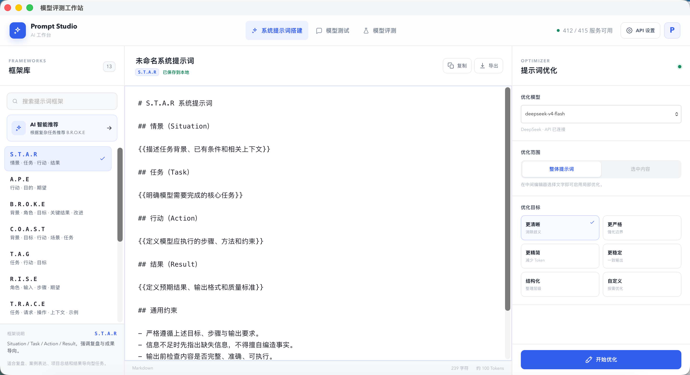
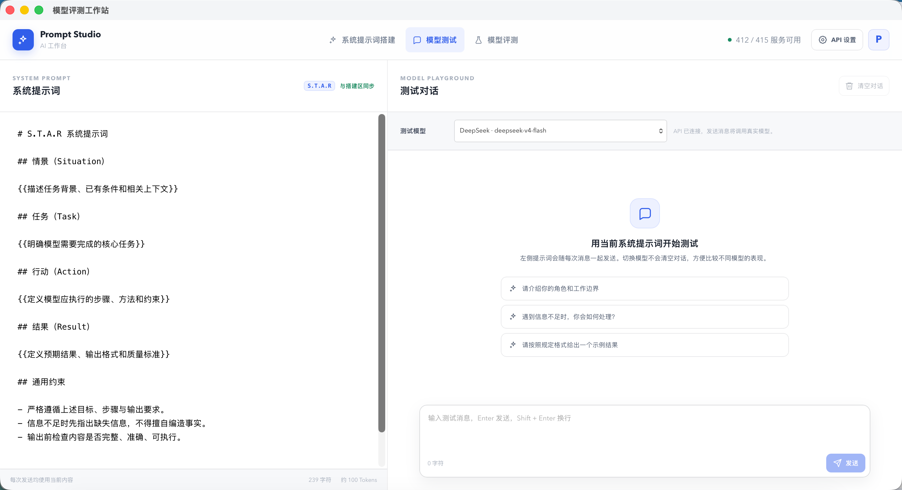
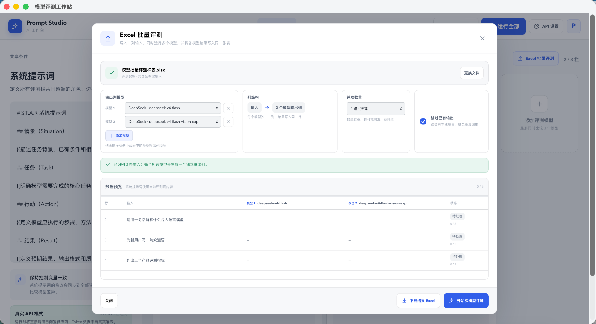

# 模型评测工作站

统一的提示词工程、模型评测和模型测试工作站。三个模块共享系统提示词、模型目录、供应商连接状态和真实模型 API 服务。



## 为什么做这个项目

提示词搭建、对话测试和模型对比通常散落在不同工具中，难以保证实验条件一致。模型评测工作站把系统提示词作为共享控制变量，让提示词编辑、真实 API 对话、1–3 个模型并排比较和 Excel 批量评测在同一个本地工作流中完成。

## 工作站模块

### 系统提示词搭建

- 从 S.T.A.R、A.P.E、B.R.O.K.E、C.O.A.S.T 等 13 个框架中选择结构并生成系统提示词。
- 在中间编辑器编写所有模块共用的系统提示词，并自动保存到浏览器本地。
- 支持复制、Markdown 导出、字符数和 Token 估算。
- 使用已配置的真实模型进行整体优化或选区优化，并将结果应用回编辑器。

### 模型评测

- 在同一系统提示词下并排比较 1–3 个真实模型。
- 每栏拥有独立的用户提示词、模型、温度和最大输出 Token。
- 支持单栏运行与运行全部已连接模型。
- 展示真实响应、请求耗时、输入 Token 和输出 Token。
- 支持导入 Excel，将一列输入并发发送给多个模型，并把每个模型的输出写回独立列。
- 批量评测可跳过已有输出、继续未完成任务，并下载包含结果的 Excel 文件。

### 模型测试

- 左侧编辑并同步当前系统提示词，右侧使用选定的真实模型进行多轮对话测试。
- 每次发送均携带当前系统提示词和已有对话上下文。
- 切换模型不会清空对话，便于在同一上下文中比较模型表现。
- 请求过程中实时显示已等待时间，完成后展示模型标识和响应时间；接口失败也会保留失败前耗时。

### 共用 API 与配置

- 三个模块读取同一 `/api/models` 模型目录。
- 模型评测和模型测试调用同一 `/api/evaluate` 服务端入口。
- 提示词优化、模型测试和模型评测共用同一模型供应商配置。
- 顶部“API 设置”可以配置、测试、启用或停用模型厂商，并可添加自定义厂商。
- 支持 OpenAI Responses、OpenAI 兼容 Chat Completions、Anthropic Messages 和 Google GenerateContent 四种协议。

## 当前能力

- 左侧共享系统提示词，修改后作用于所有评测栏。
- 每个评测栏拥有独立的用户提示词、模型选择、温度和最大输出 Token。
- 支持新增和删除评测栏，始终保留至少 1 栏，最多同时显示 3 栏。
- 支持运行单个模型或运行全部模型。
- 包含等待、生成中、完成和输入错误状态。
- 展示模型响应、耗时、输入 Token 和输出 Token，并支持复制结果。
- 桌面端自适应并排布局；窄屏端通过横向浏览保持对比栏的可读宽度。
- 服务端分别适配 OpenAI Responses API、Anthropic Messages API、Google GenerateContent API 和 DeepSeek Chat Completions API。
- 未配置 Key 的供应商会明确显示“未配置”，不会产生模拟响应。
- 支持读取 `.xlsx`、`.xls`、`.xlsm` 和 `.xlsb`，自动识别“输入”“问题”“Prompt”等常见输入列名。
- Excel 批量评测支持选择多个模型、设置并发数量、保留已有输出和实时查看逐行进度。

## 产品截图

### 系统提示词搭建与优化

从 13 个框架生成提示词结构，编辑后可调用已配置模型进行整体或选区优化。


### 模型测试

在同一系统提示词和连续对话上下文中切换模型，观察真实响应与耗时。



### 多模型并排评测

固定共享系统提示词，为每个评测栏分别设置用户提示词、模型和生成参数。


### Excel 批量评测

导入一列测试输入，并发运行多个模型，将输出写回原工作簿的独立列。



## 配置模型 API

推荐直接打开页面顶部的“API 设置”：

1. 选择 OpenAI、Anthropic、Google Gemini 或 DeepSeek，也可以点击“添加”创建自定义厂商。
2. 选择接口协议，填写 Base URL 和 API Key；在“模型”下拉列表中选择推荐模型，或点击“获取模型列表”读取当前账号真实可用的模型。
3. 若厂商未提供模型目录接口，选择“自定义模型 ID…”并填写控制台给出的完整 ID。
4. 点击“测试连接”发送一次最小真实请求，确认厂商、密钥和模型可用；测试期间会实时计时，完成或失败后会显示本次响应时间。
5. 点击“保存配置”，三个模块的模型列表会立即刷新，无需重启服务。

多数第三方中转服务、OpenRouter 和其他 OpenAI 兼容服务，应选择“OpenAI 兼容 Chat Completions”，Base URL 通常以 `/v1` 结尾；具体地址和模型 ID以厂商文档为准。

页面保存的配置存放在项目根目录的 `.model-api-settings.json` 中，文件权限设置为仅当前本机用户可读写，并已加入 `.gitignore`。服务端只向浏览器返回 API Key 掩码，不返回明文。该文件仍包含可用密钥，因此不要上传、分享或复制到不可信位置。

也可以继续通过环境变量配置内置厂商。复制示例配置：

```bash
cp .env.example .env.local
```

在 `.env.local` 中填写准备使用的供应商 Key；不需要同时配置全部供应商：

```dotenv
OPENAI_API_KEY=
ANTHROPIC_API_KEY=
GEMINI_API_KEY=
DEEPSEEK_API_KEY=
```

环境变量中的 API Key 只在本地 Node 服务中读取。页面填写的新 Key 会作为本地覆盖配置保存。运行“测试连接”、提示词优化、模型测试或模型评测都会调用真实模型，并可能产生对应供应商的 API 费用。

## 本地运行

环境要求：Node.js 20.12 或更高版本，以及 npm。

```bash
git clone https://github.com/Jaimo-so/model-evaluation-workbench.git
cd model-evaluation-workbench
npm install
npm run dev
```

如果已经下载项目，也可以直接在项目目录运行：

```bash
npm install
npm run dev
```

打开 `http://localhost:5173/`。修改 `.env.local` 后需要重启服务；通过页面保存的配置则会立即生效。界面顶部会显示当前可用模型数量。

生产构建：

```bash
npm run build
```

只执行 TypeScript 检查：

```bash
npm run check
```

## macOS 应用

在 macOS 上构建可双击打开的应用。当前打包脚本需要 Xcode Command Line Tools，并按 Apple Silicon 上的 Homebrew Node 运行时布局收集动态库：

```bash
npm run app:mac
```

构建完成后，打开 `release/模型评测工作站.app` 即可使用。应用会在独立窗口中启动工作站，并在退出时关闭后台本地服务。应用内置 Node 运行时和生产构建，不依赖全局安装的 Node。首次启动时，现有 API 配置会迁移到 `~/Library/Application Support/模型评测工作站/`，文件权限限制为仅当前用户可读写；密钥不会被打进应用包。

## 内置默认模型

- OpenAI：`gpt-5.6`
- Anthropic：`claude-sonnet-5`
- Google Gemini：`gemini-3.7-flash`
- DeepSeek：`deepseek-v4-pro`

这些只是可编辑的推荐值。账号权限、区域或厂商模型版本不同时，请在“API 设置”中获取实时模型列表，或填写实际可用的模型 ID。

## 技术实现

- 前端：React、TypeScript、Vite。
- 本地服务：Node.js HTTP 服务；开发环境通过 Vite 中间件提供页面，生产环境提供静态构建。
- 模型协议：OpenAI Responses、OpenAI 兼容 Chat Completions、Anthropic Messages、Google GenerateContent。
- 表格处理：SheetJS，用于保留工作簿并读取、写回和下载模型评测结果。
- 本地状态：系统提示词保存在浏览器 Local Storage；供应商配置保存在本机私有配置文件中。

## 项目结构

```text
.
├── src/                     # React 界面、Excel 批量处理与并发队列
├── server.mjs               # 本地服务、供应商配置与模型协议适配
├── packaging/macos/         # macOS 原生壳与应用图标生成器
├── scripts/build-macos-app.sh
├── docs/screenshots/        # README 产品截图
└── .env.example             # 环境变量示例，不包含真实密钥
```

## 数据与密钥安全

- API Key 只由本地 Node 服务读取，不会写入前端源码或浏览器 Local Storage。
- 页面保存的供应商配置位于 `.model-api-settings.json`，权限为仅当前用户可读写，并已加入 `.gitignore`。
- 服务端返回给浏览器的只是 API Key 掩码，不返回明文。
- 服务默认仅监听 `127.0.0.1`。如主动修改 `HOST` 暴露到局域网或公网，请自行增加身份验证和访问控制。
- 调用“测试连接”、提示词优化、模型测试或模型评测会向相应供应商发送内容，并可能产生费用。

## 参与贡献

欢迎提交 Issue 和 Pull Request。开始开发前请阅读 [CONTRIBUTING.md](CONTRIBUTING.md)；安全问题请按 [SECURITY.md](SECURITY.md) 中的方式报告。

## 许可证

本项目使用 [MIT License](LICENSE)。你可以使用、复制、修改和分发代码，但需要保留许可证和版权声明。
